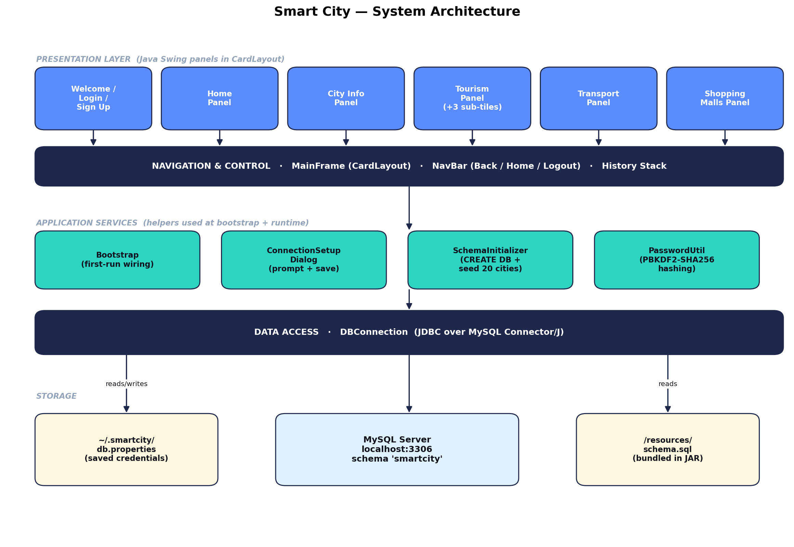
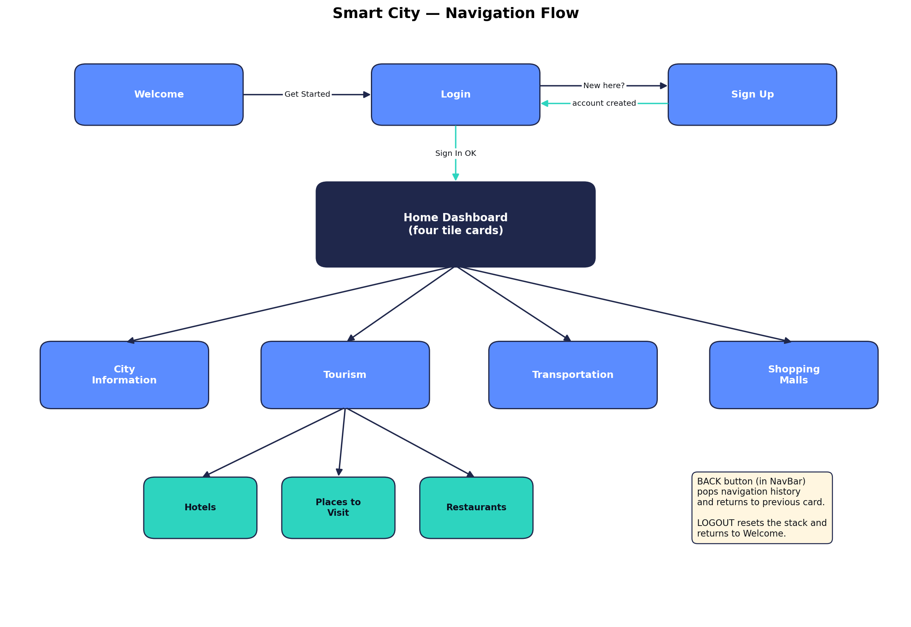
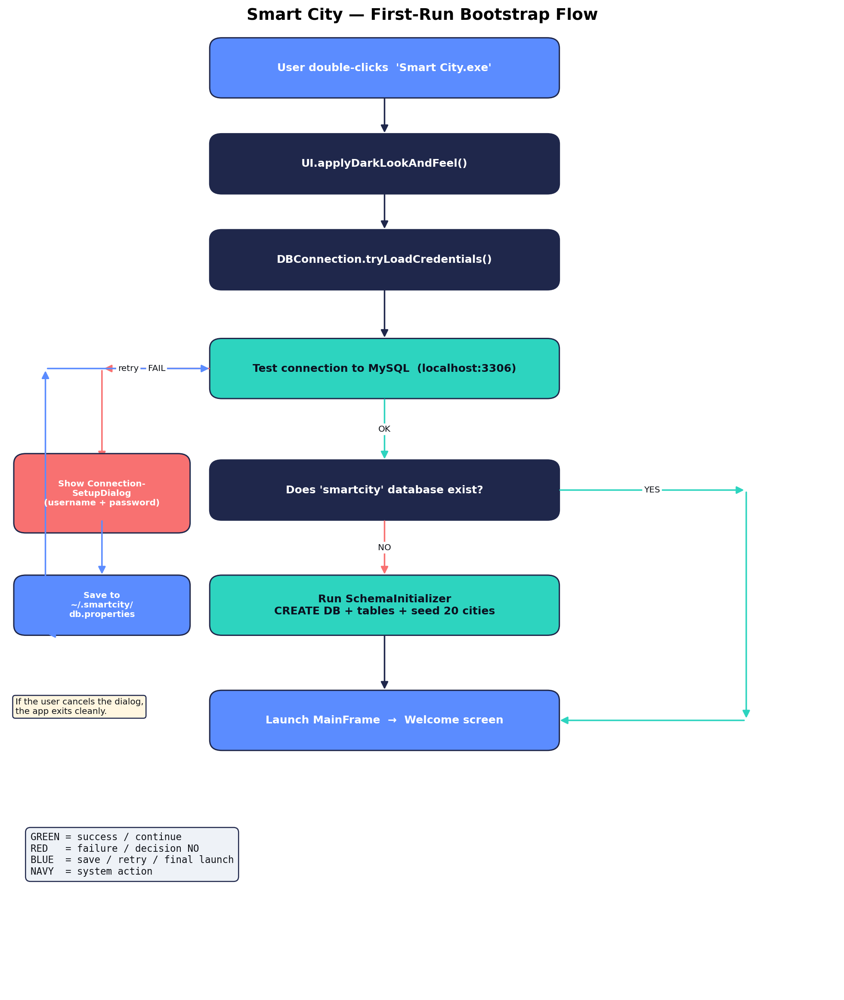
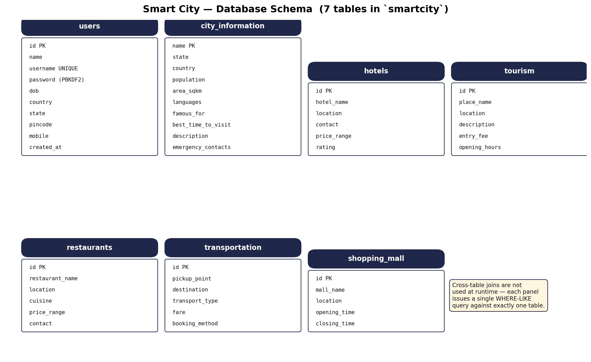

# Smart City Guide

A Java Swing desktop application for exploring a city — look up city profiles, find hotels and restaurants, search tourist places, plan transport, and browse shopping malls.

[](https://github.com/AnuragPandey19/Smart-City-Application-/releases/latest)


---

## Download

**No need to clone this repo if you only want to use the app.** Grab the latest release zip:

➡️ **[Download v1.0 (Windows installer)](https://github.com/AnuragPandey19/Smart-City-Application-/releases/tag/v1.0)**

The zip bundles its own Java runtime, so **Java is NOT required** on your machine. You only need MySQL Server (see Requirements below). Unzip → double-click `Smart City.exe` → done.

---

## Features

- **City Information** — population, area, languages, key attractions, best time to visit, emergency contacts. 20 cities ship in v1.0.
- **Tourism Hub** — Hotels, Places to Visit, and Restaurants searchable by location.
- **Transportation** — pickup → destination route lookup with fare and booking method.
- **Shopping Malls** — search malls by location with opening / closing hours.
- **Account system** — signup, login, hashed passwords (PBKDF2-HMAC-SHA256, 120,000 iterations).
- **Dark theme** — consistent palette across every screen, Nimbus-based.
- **Back navigation** — NavBar with breadcrumb, history stack, Home and Logout.
- **Self-bootstrapping** — first launch prompts for MySQL credentials, auto-creates the database and seeds 20 cities. No SQL Workbench needed.

---

## Requirements

| What | Why |
|------|-----|
| Windows x64 | Installer is Windows-only (built with jpackage). |
| MySQL Server 5.7+ or 8.x | Local storage. Install from https://dev.mysql.com/downloads/installer/ |
| ~250 MB free disk | App folder (~180 MB JRE) + MySQL install. |

Java is **NOT** required — the installer bundles its own private JRE.

---

## Quick Install (end users)

1. Install MySQL Server from https://dev.mysql.com/downloads/installer/
   - Choose **"Server only"** during setup.
   - Set a **root password** and remember it.
   - Leave port 3306 and "Install as Windows Service" at their defaults.
2. Download `Smart City.zip` from the [latest release](https://github.com/AnuragPandey19/Smart-City-Application-/releases/latest).
3. Unzip anywhere on your machine.
4. Open the `Smart City` folder → double-click `Smart City.exe`.
5. First launch only: enter your MySQL root password in the dialog → click **Test & Save**. The app creates its own database and seeds 20 cities in a couple of seconds.
6. Click **Get Started** → **Create an account** → sign in.

For a longer walkthrough including troubleshooting, see `README.txt` inside the unzipped folder.

---

## Architecture

The app is organised into four layers. Each layer talks only to the one below it.



| Layer | Components |
|-------|------------|
| Presentation | `WelcomePanel`, `LoginPanel`, `SignUpPanel`, `HomePanel`, `CityInfoPanel`, `TourismPanel`, `TransportationPanel`, `ShoppingMallsPanel` (Java Swing panels in a CardLayout). |
| Navigation & Control | `MainFrame` (CardLayout host), `NavBar` (Back / Home / Logout + breadcrumb), in-memory history stack. |
| Application Services | `Bootstrap` (first-run wiring), `ConnectionSetupDialog` (collects MySQL creds), `SchemaInitializer` (creates DB + seeds), `PasswordUtil` (PBKDF2). |
| Data Access | `DBConnection` over JDBC + MySQL Connector/J. |

### Navigation Flow



### First-Run Bootstrap



### Database Schema (7 tables)



---

## Tech Stack

- **Language:** Java 11 (compile), JDK 17+ (packaging via `jpackage`)
- **UI:** Java Swing with Nimbus look-and-feel + custom dark theme overrides
- **Database:** MySQL 5.7 / 8.x
- **JDBC:** MySQL Connector/J 9.2.0 (bundled inside the JAR)
- **Password hashing:** PBKDF2-HMAC-SHA256 (built into the JDK, no external dep)
- **Packaging:** jpackage app-image (bundled JRE, single launcher folder)
- **Build:** plain Windows batch scripts — no Maven, no Gradle

---

## Build From Source

For developers / contributors only. End users should just download the release.

### Prerequisites

- JDK 17 or newer (for `jpackage`) — install from https://adoptium.net/temurin/releases/?version=21
- MySQL Server (only required at runtime, not at build time)

### Steps

```bash
git clone https://github.com/AnuragPandey19/Smart-City-Application-.git
cd "Smart-City-Application-"

# 1. Build the runnable fat JAR (~3 MB, requires Java to run)
build.bat
# -> produces dist/SmartCity.jar
# Run with: java -jar dist\SmartCity.jar

# 2. Build the Windows app-image (~180 MB, bundles JRE, no Java needed by user)
package.bat
# -> produces installer/Smart City/Smart City.exe
```

### Running from an IDE

Open the project in IntelliJ IDEA, mark `src` as Sources Root, add `lib/mysql-connector-j-9.2.0.jar` to the project libraries, and run `com.smartcity.MainFrame.main()`. The first run prompts for MySQL credentials and saves them to `~/.smartcity/db.properties`.

For dev mode you can also drop a `db.properties` in the project root (already in `.gitignore`) with `db.user=` and `db.password=` to skip the dialog.

---

## Project Layout

```
Smart City/
├── src/com/smartcity/         # 17 Java source files
├── src/resources/schema.sql   # bundled into the JAR; runs on first launch
├── sql/schema.sql             # standalone copy for manual DB inspection
├── lib/mysql-connector-j-9.2.0.jar
├── docs/diagrams/             # architecture, navigation, bootstrap, schema PNGs
├── installer/Smart City/      # jpackage output (git-ignored)
├── build/  dist/              # build outputs (git-ignored)
├── build.bat   package.bat    # Windows build scripts
├── manifest.mf
├── Smart_City_Project_Report.docx
└── README.md
```

---

## Database Schema

Seven tables inside the `smartcity` database:

| Table | Purpose | Search method |
|-------|---------|---------------|
| `users` | Account records, hashed passwords | username = exact |
| `city_information` | City profile (10 columns: pop, area, languages, attractions, contacts, ...) | name = exact |
| `hotels` | Hotels with rating + price + contact | location LIKE |
| `tourism` | Places to visit | location LIKE |
| `restaurants` | Restaurants with cuisine + price | location LIKE |
| `transportation` | (pickup, destination) → transport type + fare | exact (pickup, destination) |
| `shopping_mall` | Malls with opening / closing time | location LIKE |

The schema is bundled inside `SmartCity.jar` and runs automatically on first launch. A standalone copy is also at `sql/schema.sql` if you want to inspect the seed data.

---

## Current Location Coverage (v1.0)

**India — Metros:** Mumbai, Bengaluru, Delhi, Chennai, Kolkata, Hyderabad, Pune, Ahmedabad
**India — Heritage & Tourist:** Jaipur, Udaipur, Varanasi, Goa, Kochi
**India — Hill Stations:** Shimla, Manali, Darjeeling
**USA:** Springfield (Illinois)
**International:** Singapore, Dubai (UAE)
**Demo / Synthetic:** TechVille (fictional tech township used by some seed transport routes)

More cities planned for future releases.

---

## Security

- Passwords stored as PBKDF2-HMAC-SHA256 with per-record 16-byte salt and 120,000 iterations (OWASP 2023 floor). Constant-time comparison on verification.
- MySQL credentials live in `~/.smartcity/db.properties`, written only after a successful test. Never hardcoded, never committed (in `.gitignore`).
- Every SQL query uses `PreparedStatement` with parameter binding — no string concatenation, no SQL injection surface.
- Every JDBC `Connection` / `PreparedStatement` / `ResultSet` opened in try-with-resources.

---

## Limitations

Honest list of what this version does **not** do:

- Requires MySQL Server installed locally. The bundled JRE removes the Java dependency but not the MySQL one.
- Windows-only installer. Mac / Linux builds require running `jpackage` on those platforms.
- Single-user. No remote MySQL support, no multi-tenant, no concurrent users.
- Read-only catalog through the UI — only user signup writes to the DB. Hotels / restaurants / transport rows are added via the seed script.
- 20 cities — illustrative, not exhaustive.
- Saved credentials are stored in a properties file, not encrypted. Anyone with read access to the file can see the MySQL password. A production app would use OS credential storage (DPAPI / Keychain).
- No automated tests (manual smoke testing only).

---

## Documentation

The full project report (architecture, design decisions, all diagrams, deployment, limitations, future work) is in [`Smart_City_Project_Report.docx`](./Smart_City_Project_Report.docx).

---

## Demo Video

[Watch the demo](https://www.linkedin.com/posts/anurag-pandey-154259280_java-oop-softwaredevelopment-activity-7313682593965584385-CY9F)

---

## Future Enhancements

- Replace MySQL with an embedded database (SQLite or H2) so the app needs zero external dependencies.
- Add an admin UI for inserting / editing hotels, restaurants, transport routes, and cities.
- Encrypt saved credentials at rest using the OS credential store (DPAPI on Windows).
- Substring + fuzzy + case-insensitive search on City Information.
- Date picker widget for the DOB field on Sign Up.
- Mac and Linux installer builds.
- JUnit test coverage on `SchemaInitializer`, `PasswordUtil`, and `SearchableTablePanel` query binding.
- Localisation (Hindi, etc.).
- Real-time transport booking + GPS integration.

---

## Author

**Anurag Pandey**
Email: anuragpandeygct@gmail.com
GitHub: [@AnuragPandey19](https://github.com/AnuragPandey19)

Bug reports, feature requests, and contributions are welcome via [GitHub Issues](https://github.com/AnuragPandey19/Smart-City-Application-/issues) or email.

---

## License

This project is released for educational / capstone purposes. Feel free to fork and adapt.
